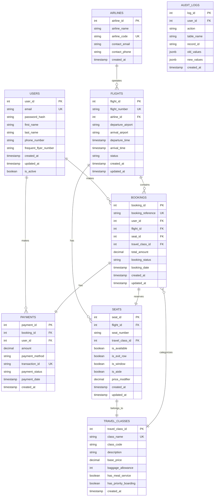

# Weengz - Entity Relationship Diagram

## Database Schema Overview

This document describes the Entity-Relationship (ER) model for the Weengz airline seat reservation system.

## ER Diagram (Mermaid Format)

## Entity Descriptions

### USERS
Stores information about registered users of the system.
- Primary Key: `user_id`
- Unique: `email`, `frequent_flyer_number`
- Relationships: Makes bookings and payments

### AIRLINES
Contains airline company information.
- Primary Key: `airline_id`
- Unique: `airline_code`
- Relationships: Operates flights

### FLIGHTS
Stores flight schedule and route information.
- Primary Key: `flight_id`
- Unique: `flight_number`
- Relationships: Operated by airlines, contains bookings and seats

### TRAVEL_CLASSES
Defines different travel classes (Economy, Premium Economy, Business, First).
- Primary Key: `travel_class_id`
- Unique: `class_name`
- Relationships: Categorizes bookings and seats

### SEATS
Represents individual seats on flights.
- Primary Key: `seat_id`
- Composite Unique: `flight_id + seat_number`
- Relationships: Belongs to flight and travel class, can be reserved in bookings

### BOOKINGS
Stores reservation information.
- Primary Key: `booking_id`
- Unique: `booking_reference`
- Relationships: Made by users, for flights, reserves seats, has payment

### PAYMENTS
Tracks payment transactions.
- Primary Key: `payment_id`
- Unique: `transaction_id`
- Relationships: Made by users, associated with bookings

### AUDIT_LOGS
Maintains audit trail of all database changes.
- Primary Key: `log_id`
- Used for compliance and debugging

## Key Relationships

1. **User to Booking**: One-to-Many (A user can make multiple bookings)
2. **Flight to Booking**: One-to-Many (A flight can have multiple bookings)
3. **Booking to Seat**: One-to-One (Each booking reserves exactly one seat)
4. **Booking to Payment**: One-to-One (Each booking has one payment)
5. **Flight to Seat**: One-to-Many (A flight has multiple seats)
6. **Travel Class to Seat**: One-to-Many (A travel class includes multiple seats)
7. **Airline to Flight**: One-to-Many (An airline operates multiple flights)

## Business Rules

1. Each booking must reference a valid user, flight, and seat
2. Seats can only be booked once per flight
3. Payment must be completed before booking is confirmed
4. Users must have unique email addresses
5. Flight numbers must be unique within the system
6. Booking references are auto-generated and unique
7. Audit logs are append-only and cannot be deleted
8. Inactive users cannot make new bookings
